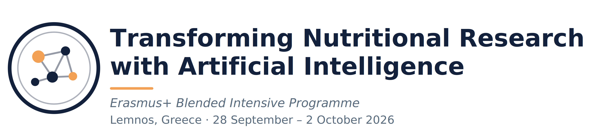

# bip



**Transforming nutritional research with artificial intelligence.**

An Erasmus+ Blended Intensive Programme.

University of the Aegean, Department of Food Science & Nutrition — Lemnos, 28 Sep – 2 Oct 2026.

---

This repository exists so the course notebooks can load files **quickly and reliably** during class, without cloning, authentication, or large downloads. 


## Structure

Files are organised **by type**, not by session.

* images/ food photographs used in image-recognition sessions
* datasets/ small tabular files (CSV) — nutrient tables, example records
* texts/ text corpora — example dietary recalls, prompts
* documents/ handouts, slides, reference PDFs


## How the notebooks use it

Everything is fetched by raw URL. Nothing needs to be cloned.

```python
BASE = "https://raw.githubusercontent.com/skaloudis/bip/main/"
```

`https://github.com/skaloudis/bip`


## Contact

Stathis Kaloudis - `stathiskaloudis@aegean.gr`

Vasiliki Bountziouka - `vboun@aegean.gr`

website: [pygad.fns.aegean.gr/BIP](https://pygad.fns.aegean.gr/index.php/bip/)

[eclass course page](https://eclass.aegean.gr/courses/FNS-OTHER166/) 
